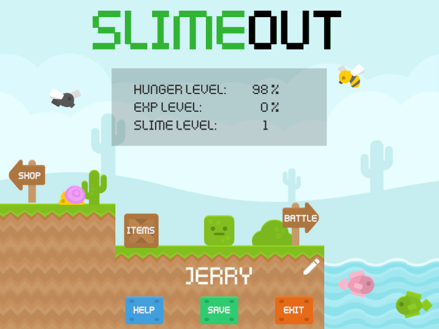
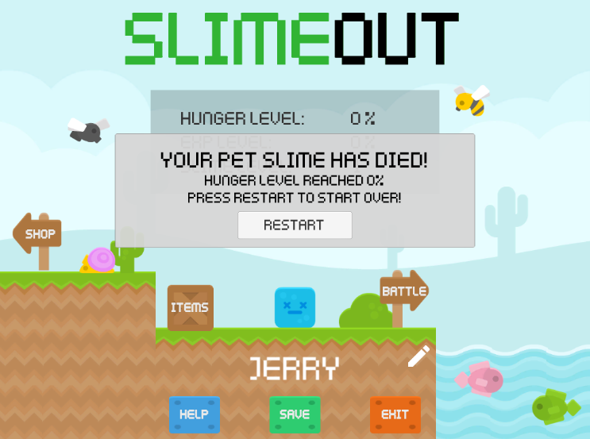

# SlimeOut

SlimeOut is an interactive pet game designed to allow users to simulate the
experience of raising a pet slime. The user is able to interact with their pet
in multiple ways, such as feeding their pet. The user is also able to interact
in PVE battles. These battles are turn-by-turn style fights where a user
selects moves from their slime's skill set and attempts to defeat their
opponent. After the battle is complete, the user may receive a reward
(i.e. currency or in-game items) depending on the outcome, and their slime will
grow in level as a result of the battle experience gained. Currency can be used 
in the shop, where users can purchase food or other items for their slime. 
Items can be used to help the slime grow and thrive. Food items have a special
effect where the pet slime will change colours according to the colour of the
food. If at any point a user would like instructions or a tutorial for the game, 
the help screen will provide a menu explaining the different interactions and 
functionalities available in the game. 

